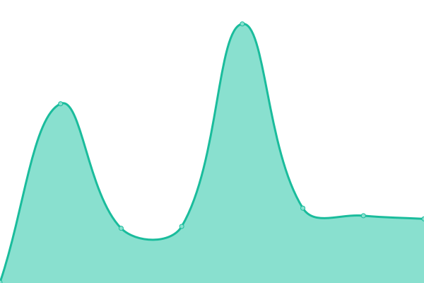
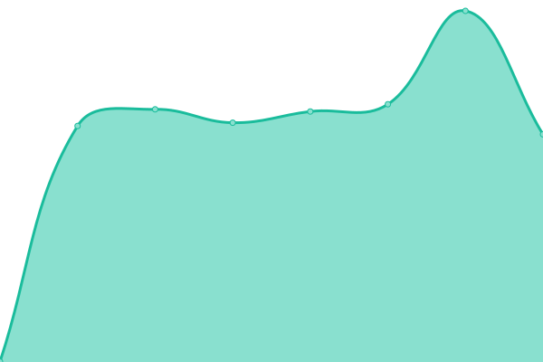

# [📈 Live Status](https://skh113.github.io/apply-score-uptime): <!--live status--> **🟩 All systems operational**

This repository contains the open-source uptime monitor and status page for [Keyvan Hosseini](https://www.keyvanhosseini.ir/), powered by [Upptime](https://github.com/upptime/upptime).

With [Upptime](https://upptime.js.org), you can get your own unlimited and free uptime monitor and status page, powered entirely by a GitHub repository. We use [Issues](https://github.com/skh113/apply-score-uptime/issues) as incident reports, [Actions](https://github.com/skh113/apply-score-uptime/actions) as uptime monitors, and [Pages](https://skh113.github.io/apply-score-uptime) for the status page.

<!--start: status pages-->
<!-- This summary is generated by Upptime (https://github.com/upptime/upptime) -->
<!-- Do not edit this manually, your changes will be overwritten -->
<!-- prettier-ignore -->
| URL | Status | History | Response Time | Uptime |
| --- | ------ | ------- | ------------- | ------ |
|  [Google](https://www.google.com) | 🟩 Up | [google.yml](https://github.com/skh113/apply-score-uptime/commits/HEAD/history/google.yml) | 

 94ms
     
 | 

<a href="https://skh113.github.io/apply-score-uptime/history/google">100.00%</a>
    

|  [Wikipedia](https://en.wikipedia.org) | 🟩 Up | [wikipedia.yml](https://github.com/skh113/apply-score-uptime/commits/HEAD/history/wikipedia.yml) | 

 235ms
     
 | 

<a href="https://skh113.github.io/apply-score-uptime/history/wikipedia">100.00%</a>
    

|  [Sanagiti](https://sanagiti.com/) | 🟩 Up | [sanagiti.yml](https://github.com/skh113/apply-score-uptime/commits/HEAD/history/sanagiti.yml) | 

 1364ms
     
 | 

<a href="https://skh113.github.io/apply-score-uptime/history/sanagiti">100.00%</a>
    

|  [Sanagiti dev](https://dev.applyscore.co.uk/) | 🟩 Up | [sanagiti-dev.yml](https://github.com/skh113/apply-score-uptime/commits/HEAD/history/sanagiti-dev.yml) | 

 1378ms
     
 | 

<a href="https://skh113.github.io/apply-score-uptime/history/sanagiti-dev">100.00%</a>
    

|  [ApplyScore](https://applyscore.net/) | 🟩 Up | [apply-score.yml](https://github.com/skh113/apply-score-uptime/commits/HEAD/history/apply-score.yml) | 

 644ms
     
 | 

<a href="https://skh113.github.io/apply-score-uptime/history/apply-score">100.00%</a>
    

|  [ApplyScore dev](https://dev.applyscore.net/) | 🟩 Up | [apply-score-dev.yml](https://github.com/skh113/apply-score-uptime/commits/HEAD/history/apply-score-dev.yml) | 

 614ms
     
 | 

<a href="https://skh113.github.io/apply-score-uptime/history/apply-score-dev">100.00%</a>
    

<!--end: status pages-->

[**Visit our status website →**](https://skh113.github.io/apply-score-uptime)

## 📄 License

- Powered by: [Upptime](https://github.com/upptime/upptime)
- Code: [MIT](./LICENSE) © [Anand Chowdhary](https://anandchowdhary.com), supported by [Pabio](https://pabio.com)
- Data in the `./history` directory: [Open Database License](https://opendatacommons.org/licenses/odbl/1-0/)
